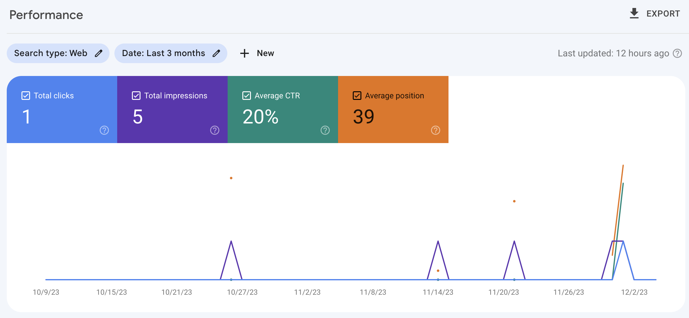

### **Project Overview**:
* Role: Integral team member focused on digital enhancements for the Uncommonvcu website.
* Duration: September 2023 - December 2023.
* Association: Part of a collaborative effort with Virginia Commonwealth University to boost the digital footprint of the women's soccer fan site.

### **Technical Contributions**:
* Developed a responsive and user-friendly website leveraging WordPress.
* Implemented a comprehensive SEO strategy, focusing on alt text, captions, and image optimizations to improve search rankings.
* Utilized Bing Places for Business and Google Search Console for performance analytics to enhance local SEO and visibility.

### **Operational Achievements**:
* Resolved compatibility issues between WordPress and the Elementor page builder, maintaining a consistent user interface across the site.
* Played a key role in formulating and executing a digital marketing strategy that led to a 20% increase in user engagement via click-through rates.

### **Skills Applied**:

* Web Development: Creating a seamless interface for optimal functionality.
* SEO: Employing best practices to elevate the site's search engine placement.
* Data Analysis: Interpreting web analytics to inform strategy adjustments.
* Problem-Solving: Addressing and fixing core issues affecting site performance and user experience.
* Digital Marketing Strategy: Crafting and implementing tactics to boost online engagement and fan interaction.

# UncommonVCU Website
https://github.com/Pyken10/Digital-Marketing-Project-for-Uncommonvcu/tree/main#:~:text=5%20Commits-,Google%20console.png,-Add%20files%20via)

# Google analytics of UncommonVCU

